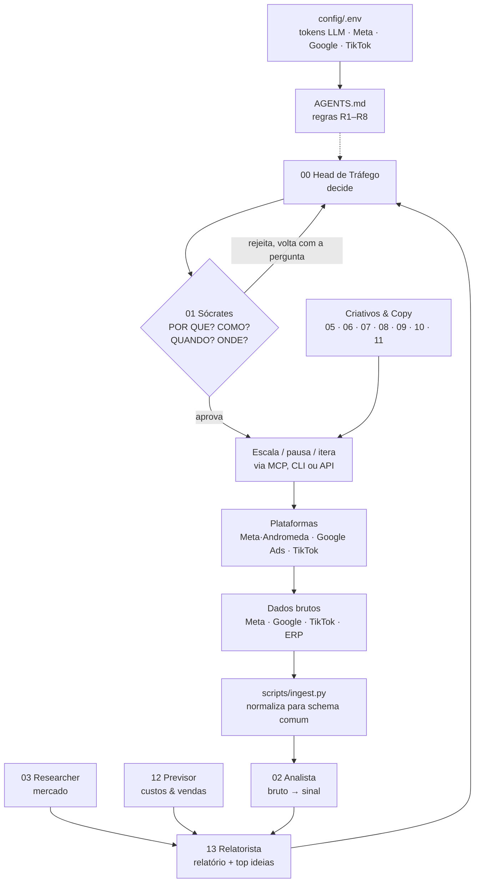

# 🚦 trafego-os

<p align="center"></p>

**O departamento de tráfego pago que funciona sozinho.**
Quatorze agentes especializados — head de tráfego, analista de dados brutos, hacker de algoritmos, quatro copywriters de direct response, growth hacker, previsor de custos e vendas — em um único repositório, prontos para serem montados em qualquer LLM e operarem amanhã de manhã. Colocou suas chaves em `config/.env`, os agentes pegam e rodam.

[](LICENSE) · [] · []

> **Passado, presente e futuro em um só motor.** Toda decisão é ancorada no que funcionou *ontem* (dados brutos da conta), no que está acontecendo *hoje* (leilão e algoritmo das plataformas, incluindo Meta Andromeda) e no que tende a valer *amanhã* (pesquisa de mercado e forecast com banda de erro). Tudo passa pelo crivo socrático: **POR QUE? COMO? QUANDO? ONDE?**

## 🔑 Chaves & tokens (o time pega e roda)

Copie `config/.env.example` para `config/.env` e preencha o que tiver — LLM (para gerar criativos/copy), Meta, Google Ads, TikTok, GitHub. O `config/TOKENS.md` diz exatamente **quém usa qual chave** e em qual fase. Comece com tokens de **leitura**; escrita (mover budget/status) só libera quando o agente 00 receber permissão no handshake. O `.env` nunca vai pro git.

## Por que existe

Agência de tráfego pago morre de três coisas:

1. **Informação espalhada** — entre 14 abas, 3 planilhas e a cabeça do analista.
2. **Decisão por sensação** — mover budget porque "sentiu" que o criativo cansou.
3. **Estrutura copiada sem mecanismo** — ninguém entende leilão, fase de aprendizado e ciclo de vida do criativo de verdade.

O `trafego-os` resolve as três: a agência inteira em arquivos de texto — método, time de agentes, prompts, templates, estruturas de campanha validadas (CBO, ABO, PMax, Search), pipeline de dados e scripts Python que rodam **sem nenhuma dependência externa**. Não é um prompt solto. É sistema operacional.

## O time (17 agentes)

| # | Agente | Missão | Entregável-chave | KPI dono |
|---|--------|--------|------------------|----------|
| 00 | Head de Tráfego | Dono do resultado de mídia; decide escalar, pausar, iterar | Diário de decisões (hipótese + prazo + revisão) | CAC blended, ROAS, MER |
| 01 | Sócrates (Guardião) | Audita toda decisão com POR QUE / COMO / QUANDO / ONDE | Pare/continua justificado | % decisões devolvidas sem motivo |
| 02 | Analista de Dados Brutos | Transforma export bruto em sinal | Top 5 achados do dia com severidade | Latência insight (< 10 min pós-corte) |
| 03 | Researcher de Mercado | Concorrente, sazonalidade, preço, trend | Radar semanal de oportunidades | ICE dos achados validados |
| 04 | Hacker de Algoritmos | Domínio técnico de Meta (incl. Andromeda), Google, TikTok | Mapa do algoritmo versionado | Detecção de mudança de leilão < 48h |
| 05 | Criativo Direct Response | Big ideas, hooks, 3 primeiros segundos | 10 big ideas por ciclo, 8 mortas no lab | Thumbstop, CTR, HCR |
| 06 | Copywriter Funil AAAR | Mensagem do clique à primeira compra ativa | Kit de copy por estágio | CVR do funil, mensagem-mãe |
| 07 | Copywriter Engajamento | Comentários, DM, comunidade, UGC | Scripts + cadência de engajamento | Retenção D30, volume de conversa |
| 08 | Copywriter Retenção & LTV | Onboarding, recuperação, recorrência | Fluxos completos de retenção | Repurchase rate, LTV |
| 09 | Copywriter Ofertas Black & White | Estrutura de oferta, preço, garantia, upsell | Oferta completa pronta para vender | AOV, ROAS por oferta |
| 10 | Growth Hacker | Experiências fora do mídia: referral, SEO, parcerias | 2–4 testes ativos por semana | Queda de CAC blended |
| 11 | Otimizador de Criativos | Ciclo de vida, fatigue, reciclagem de ângulos | Índice de fatigue diário por criativo | Meia-vida dos criativos |
| 12 | Previsor de Custos & Vendas | Forecast 7/30 dias em 3 cenários, calibrado na conta | Forecast com banda de erro | MAPE < 15% |
| 13 | Relatorista | Relatórios precisos + ideias de melhoria ranqueadas | Relatório diário/semanal/mensal | Adoção das ideias sugeridas |
| 14 | Relatorista Streamlit | Painel único com todos os dados, campanhas e criativos | Dashboard interativo (1 comando) | Decisões tomadas olhando o painel |
| 15 | LP & Conversão (CRO) + CRM de Sites | Landing de alta conversão e ciclo de vida do lead | Auditoria 0–100 + testes com amostra | CVR por origem, receita do CRM |
| 16 | Tracking Ponta a Ponta | Do clique à receita: pixel, CAPI, dedupe, ERP | TRACK-AUDIT com 6 checkpoints | Gap plataforma×ERP < 5% |

Cada agente é um arquivo: `agents/<número>-<nome>/AGENT.md`. Missão, protocolo socrático, rotinas, regras duras, KPIs, ferramentas e prompt de ativação. **Copiou o arquivo, o agente existe.**

## Arquitetura



O anel fecha todo dia: **bruto → sinal → decisão → execução → novo bruto.** O forecast (12) roda sempre contra a realidade e corrige o modelo — é assim que *ontem* alimenta *hoje* e *hoje* alimenta *amanhã*.

## Quickstart — 3 minutos

1. **Monte o time:** abra `AGENTS.md` num chat novo (Claude, GPT, Cursor…) e cole junto com qualquer `AGENT.md` do agente que você quer ativar. Ele acorda dentro do sistema, sabendo a quem reporta e onde estão as chaves (`config/TOKENS.md`).
2. **De-lhe dados:** `python3 scripts/forecast.py --budget 30000 --cpm 25 --ctr 0.015 --cvr 0.03 --ticket 97 --margem 0.6` → funil completo, CAC, ROAS, break-even e 3 cenários. Com CSV real: `python3 scripts/metrics.py data/processed/norm-YYYYMMDD.csv`.
3. **Estruturas prontas:** `docs/07-estruturas-validadas.md` traz os blueprints de campanha **validados** (Meta CBO, Meta ABO, Google PMax, Google Search) com versões JSON em `data/estruturas/` para o agente carregar e montar.
4. **Dashboard:** `pip install -r requirements.txt && streamlit run scripts/dashboard.py` → KPIs, todas as campanhas/criativos por plataforma, índice de fatigue e forecast, tudo alimentado pelo pipeline (ou upload de CSV direto no painel).

Sem internet, sem pip install, sem framework. Python 3.9+ nativo.

## O método socrático (o diferencial)

Todo agente carrega o mesmo protocolo antes de executar **qualquer** ação:

- **POR QUE?** — qual é a hipótese causal? ("Escalo porque CAC está 22% abaixo do break-even há 7 dias consecutivos." Nunca: "escala porque está rodando.")
- **COMO?** — mecanismo e execução: quanto, onde, em que passo (+20% ao dia por 3 dias, não +100% de uma vez).
- **QUANDO?** — janela temporal e condição de entrada/saída (após 48h de leitura, parar se CPA passar 1.4× alvo).
- **ONDE?** — conta, campanha, placement, público, horário. Nunca "aí nos anúncios".

E a pergunta final, a mais brutal: **"o que me faria mudar de ideia?"** Se a resposta for "nada", não é decisão — é teimosia. O agente 01 (Sócrates) existe para devolver decisão que não passe nessas perguntas. Detalhes em [`docs/01-socratismo.md`](docs/01-socratismo.md).

## Mapa do repositório

```
trafego-os/
├── AGENTS.md                  # como montar o time (hub de orquestração)
├── assets/logo.svg            # o logo
├── config/                    # CHAVES: .env.example + TOKENS.md (quém usa o quê) + mcp.example.json
├── agents/                    # 14 agentes, 1 pasta cada, AGENT.md = o agente
├── docs/
│   ├── 01-socratismo.md       # o método POR QUE/COMO/QUANDO/ONDE
│   ├── 02-algoritmos-plataformas.md  # Meta·Andromeda, Google, TikTok — o mecanismo
│   ├── 03-forecast-unidades.md # matemática de custos, vendas e cenários
│   ├── 04-funil-aaar.md       # Aquisição · Ativação · Retenção · Receita (+engajamento)
│   ├── 05-direct-response-ofertas.md # copy DR + ofertas black & white
│   ├── 06-glossario-metricas.md      # dicionário comum de métricas
│   └── 07-estruturas-validadas.md    # blueprints: Meta CBO · Meta ABO · Google PMax · Google Search
├── workflows/                 # criação de conta e estrutura (Meta MCP/CAPI, Google, TikTok, pipeline)
├── prompts/                   # 9 prompts de operação prontos para colar
├── templates/                 # relatórios, checklists, registro de decisões e experimentos
├── scripts/                   # metrics.py · ingest.py · forecast.py (stdlib puro) + dashboard.py (streamlit)
└── data/
    ├── estruturas/            # esqueletos JSON das campanhas validadas (agentes carregam)
    ├── exemplos/              # schemas.md + CSVs de exemplo
    └── raw/ processed/        # raw imutável → processado
```

## O pipeline de dados

`data/raw/` guarda os exports **brutos** como vieram. `scripts/ingest.py` normaliza para o schema comum (`data/exemplos/schemas.md`). `scripts/metrics.py` produz o relatório numérico (CTR, CPM, CPC, CPA, ROAS por nível/dia, índice de fatigue, anomalias por z-score). O agente 02 consome isso e devolve **ideias**, não tabelas. O agente 12 corrige o forecast contra o real. Nada de "olhei o painel e senti".

## Roadmap

Ver [`ROADMAP.md`](ROADMAP.md) — integrações MCP (conta criada e estruturada via token, não via screenshot) e o plano [`GO-TO-STARS`](GO-TO-STARS.md).

## Contribuição

Colabore abrindo issue ou PR — veja [`CONTRIBUTING.md`](CONTRIBUTING.md). A regra de ouro do projeto: **nenhum prompt entra no repositório sem exemplo de saída esperada.**

## Licença

[MIT](LICENSE) — use, forkue, estoure as estrelas, me conte.
